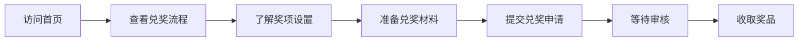

## 1. 产品概述

AGMC 数学竞赛兑奖流程官方文档网站，为参赛选手和指导老师提供清晰、完整的兑奖指引，包括兑奖条件、所需材料、办理流程、注意事项等核心信息。

- 目标用户：AGMC 数学竞赛获奖选手、指导教师、学校负责人
- 核心价值：简化兑奖流程，提升用户体验，降低咨询成本

## 2. 核心功能

### 2.1 功能模块

1. **首页**：Hero 宣传区、核心特性展示、快速入口导航
2. **兑奖流程页**：分步详解兑奖全流程
3. **奖项设置页**：各奖项等级及对应奖品说明
4. **常见问题页**：FAQ 问答列表
5. **联系我们页**：联系方式和支持渠道

### 2.2 页面详情

| 页面名称 | 模块名称 | 功能描述 |
|-----------|-------------|---------------------|
| 首页 | Hero 区域 | 大赛 Logo、标语、主要行动按钮 |
| 首页 | 特性卡片 | 三大核心优势/特点展示 |
| 首页 | 快速入口 | 跳转至各主要页面的快捷卡片 |
| 兑奖流程页 | 步骤导航 | 时间线式步骤展示 |
| 兑奖流程页 | 详细说明 | 每个步骤的图文说明 |
| 奖项设置页 | 奖项列表 | 各等级奖项的奖品说明 |
| 常见问题页 | FAQ 折叠面板 | 可展开/收起的问答列表 |
| 联系我们页 | 联系方式卡片 | 多种联系渠道展示 |

## 3. 核心流程

用户从首页进入，浏览兑奖流程，按步骤准备材料，完成兑奖申请。

## 4. 用户界面设计

### 4.1 设计风格

- **主色调**：紫色系（#5f67ee），呼应 NapCat 风格，传递专业与活力
- **辅助色**：深紫色渐变、浅紫色背景、白色卡片
- **按钮风格**：圆角矩形，主按钮紫色渐变，悬停有轻微上浮效果
- **字体**：现代无衬线字体，标题加粗，正文清晰易读
- **布局风格**：顶部导航栏 + 左侧侧边栏 + 右侧内容区的三栏文档式布局
- **图标风格**：线性图标，简洁现代

### 4.2 页面设计概览

| 页面名称 | 模块名称 | UI 元素 |
|-----------|-------------|-------------|
| 首页 | Hero 区域 | 大标题、副标题、渐变背景、主按钮、展示图 |
| 首页 | 特性卡片 | 三列卡片布局、图标 + 标题 + 描述 |
| 兑奖流程页 | 时间线 | 竖向时间线、步骤编号、图标、详细内容 |
| 所有页面 | 导航栏 | Logo、导航链接、GitHub 图标、主题切换 |
| 所有页面 | 侧边栏 | 可折叠菜单、当前页高亮、分组标题 |

### 4.3 响应式设计

- 桌面端优先设计（≥1024px）
- 平板端（768px-1024px）：侧边栏可收起
- 移动端（<768px）：侧边栏变为抽屉式，单列布局
- 触控优化：按钮最小 44px，增加点击区域

### 4.4 交互动效

- 页面加载：元素渐入动画
- 悬停效果：卡片上浮、按钮发光
- 侧边栏：平滑展开收起
- 滚动：导航栏毛玻璃效果
- FAQ：展开收起平滑过渡
