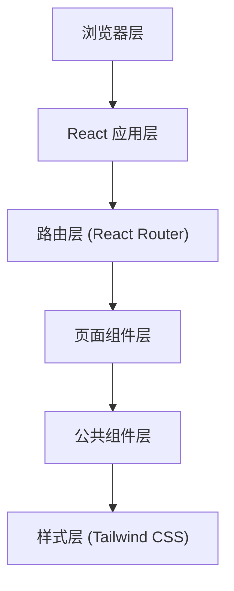

## 1. 架构设计



## 2. 技术描述

- **前端框架**：React 18 + TypeScript
- **构建工具**：Vite 5
- **样式方案**：Tailwind CSS 3
- **路由管理**：React Router DOM 6
- **状态管理**：Zustand（用于全局 UI 状态）
- **图标库**：Lucide React
- **部署方式**：静态页面部署（GitHub Pages）

## 3. 路由定义

| 路由 | 页面组件 | 用途 |
|-------|---------|------|
| / | HomePage | 首页 - Hero 区域 + 特性卡片 + 快速入口 |
| /guide/redemption | RedemptionPage | 兑奖流程 - 详细步骤说明 |
| /guide/awards | AwardsPage | 奖项设置 - 各奖项说明 |
| /faq | FaqPage | 常见问题 - FAQ 列表 |
| /about/contact | ContactPage | 联系我们 - 联系方式 |

## 4. 项目结构

```
src/
├── components/          # 公共组件
│   ├── Layout/         # 布局组件
│   │   ├── Navbar.tsx  # 顶部导航栏
│   │   ├── Sidebar.tsx # 左侧边栏
│   │   └── Layout.tsx  # 整体布局容器
│   ├── Hero.tsx        # 首页 Hero 组件
│   ├── FeatureCard.tsx # 特性卡片组件
│   ├── Timeline.tsx    # 时间线组件
│   └── FaqItem.tsx     # FAQ 折叠面板
├── pages/              # 页面组件
│   ├── HomePage.tsx
│   ├── RedemptionPage.tsx
│   ├── AwardsPage.tsx
│   ├── FaqPage.tsx
│   └── ContactPage.tsx
├── data/               # 静态数据
│   ├── sidebar.ts      # 侧边栏菜单配置
│   ├── faq.ts          # FAQ 数据
│   └── awards.ts       # 奖项数据
├── App.tsx             # 应用入口
├── main.tsx            # React 入口
└── index.css           # 全局样式
```

## 5. 组件设计原则

- **单一职责**：每个组件只负责一个功能
- **可复用性**：公共组件提取到 components 目录
- **类型安全**：使用 TypeScript 接口定义 props
- **响应式**：使用 Tailwind 响应式前缀适配多端
- **可访问性**：语义化 HTML，合理的 ARIA 属性

## 6. 样式策略

- 使用 Tailwind CSS 原子化样式
- 自定义主题色扩展 Tailwind 配置
- CSS 变量管理主题色（支持暗黑模式扩展）
- 组件级样式通过 Tailwind 类名组合实现
